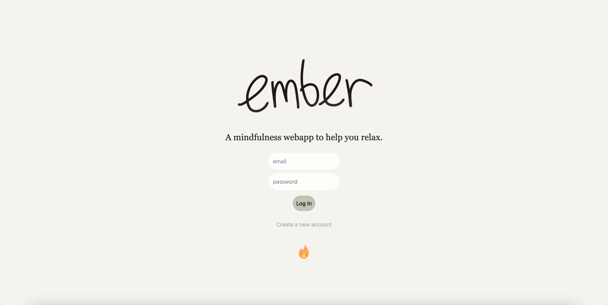
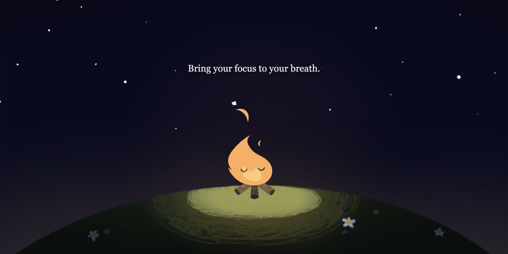
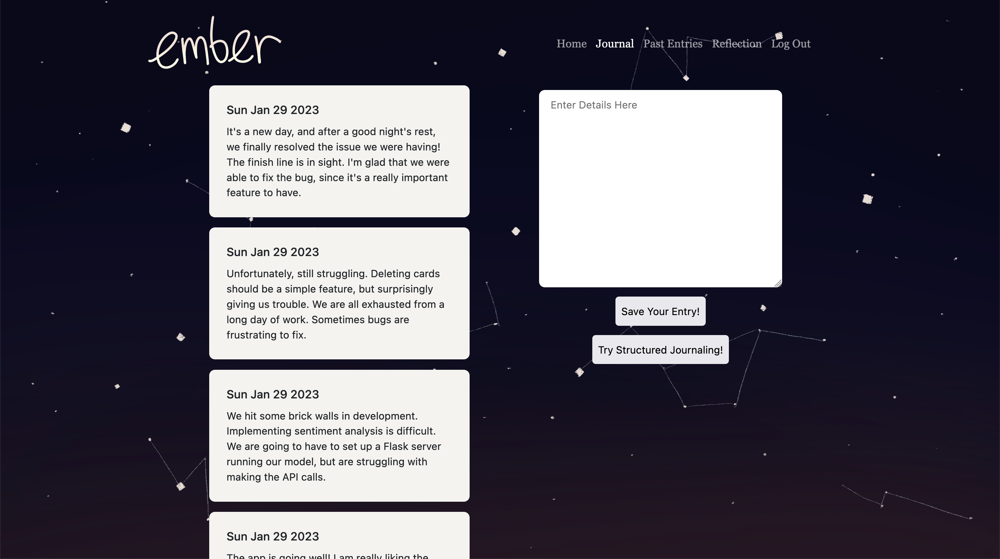
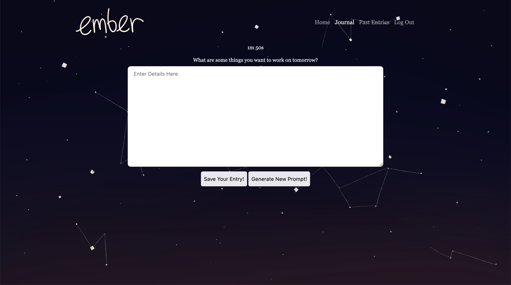
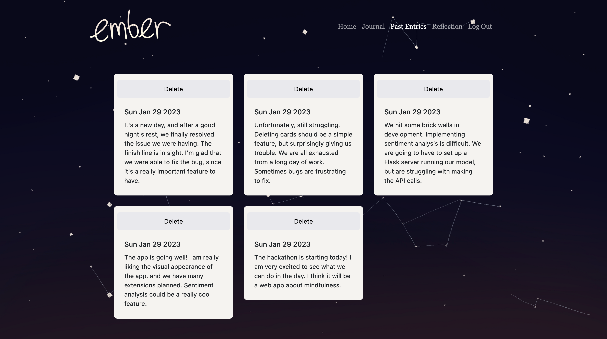
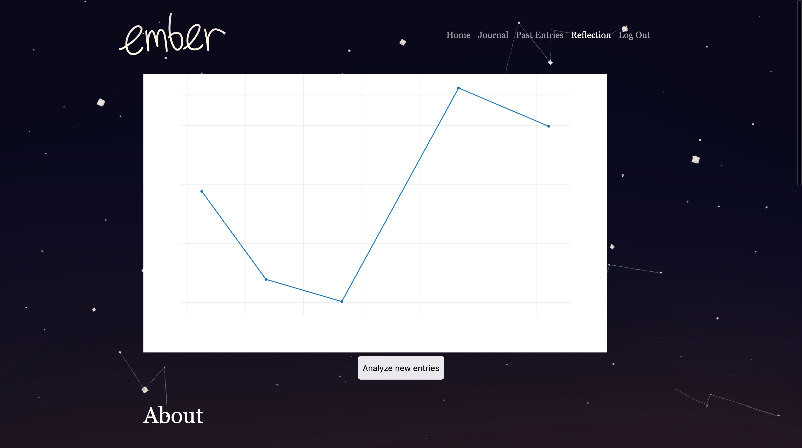
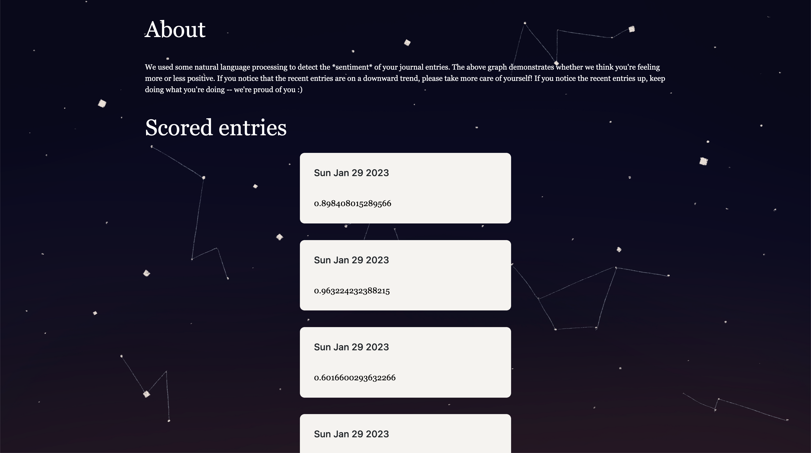

# Welcome to Ember!
A mindfulness webapp to help you relax, featuring guided meditation, journaling, sentiment analysis, and a little campfire friend!

## Inspiration
In an era of attention-grabbing apps, constant streams of content, stressors coming from every direction imaginable, and notifications popping up on your screen every two minutes, digital peace is hard to find. That's why we decided to make Ember, an uncluttered, peaceful meditation webapp!

## What it does
Ember is a mindfulness webapp that helps you relax with a calming campfire animation and guided meditation prompts. There is a space for you to journal your thoughts, whether on your own or with structured journaling (includes a prompt and a 2-minute timer), and you can always look back on or delete previous journal entries. Notably, the website includes a section where you can reflect on your thoughts using sentiment analysis, which takes all your past entries and analyzes trends of your mood, emotions, and feelings.

## How we built it
We built the website using HTML/CSS/JavaScript. User authentication and database management was done with Firebase. We used Flask for the sentiment analysis algorithm. Mockups and assets such as the campfire animation and background were hand-drawn in Procreate.

## Challenges we ran into
We encountered a lot of bugs and issues with Flask, such as being unable to post data to Flask (a lot of "cross-origin request blocked!"). We reached out to mentors, took breaks, and talked through our code with each other to assist in debugging.

## Screenshots

The login page. Users can log in with an existing email and password,
or go through the new account creation flow to access the app.

Once users log in, they are greeted with a clean, peaceful screen with a fading navbar and encouraging messages. They can proceed to the journaling page either by clicking on the flame or by navigating through the navbar.

Here is where users can record their daily thoughts, feelings, and notes for themselves. A few recent notes are displayed on the side for the user to reference when writing their new notes. They can either journal freely like this, or in a more prompted fashion, as
shown below. Entries are stored in a Firebase Firestore, enabling users to access their notes anywhere.

If users get into a mental block while journalling, they can enter a guided journaling session with a prompt to stimulate their thoughts. Their entry will be saved along with the prompt.

Here, users can read through all of their past notes, and delete previous entries if they wish. In the future, it would be nice to include a filtering/searching feature to make it easier for users to find that one note they're looking for.

User notes are anonymously scored for sentiment using an ML model developed on Python. Using this data, users can track their mood over time in this graph, and make adjustments to their lifestyle if they enter an extended period of lower morale.

Helpful notes to explain what is going on in this page, and more specific scores displayed below. In the future, it would be nice to incorporate Named Entity Recognition into the project to help diagnose specifically what is affecting their mood.

Thank you for reading! <3
Team No Pineapples

Z(C)HANG DYNASTY B)))))))
gong empire is also kind of cool
stepin

http://brandons-mbp-5.devices.brown.edu:5002/
http://brandons-mbp-5.devices.brown.edu:5002/login.html